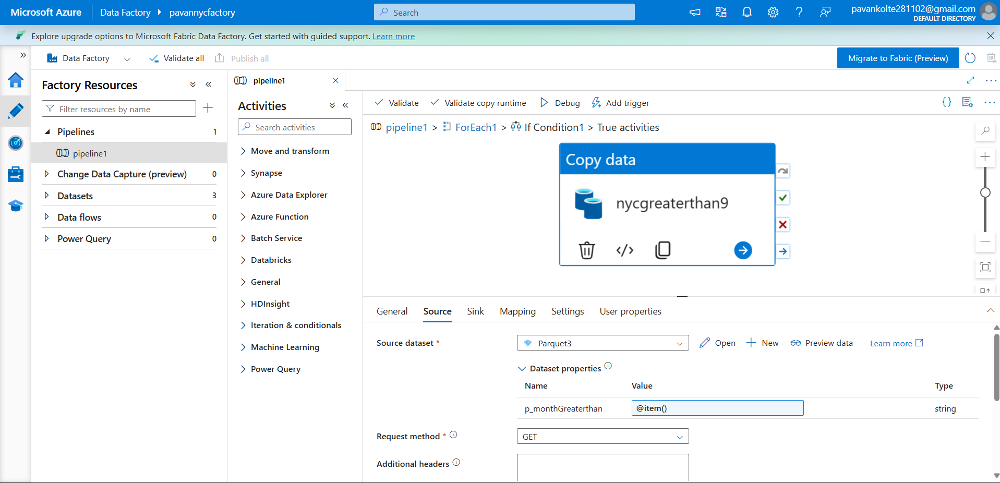
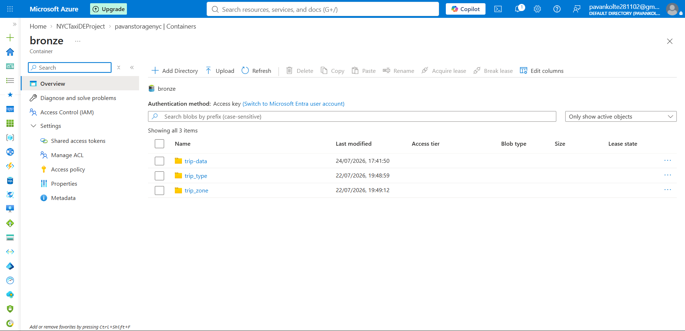
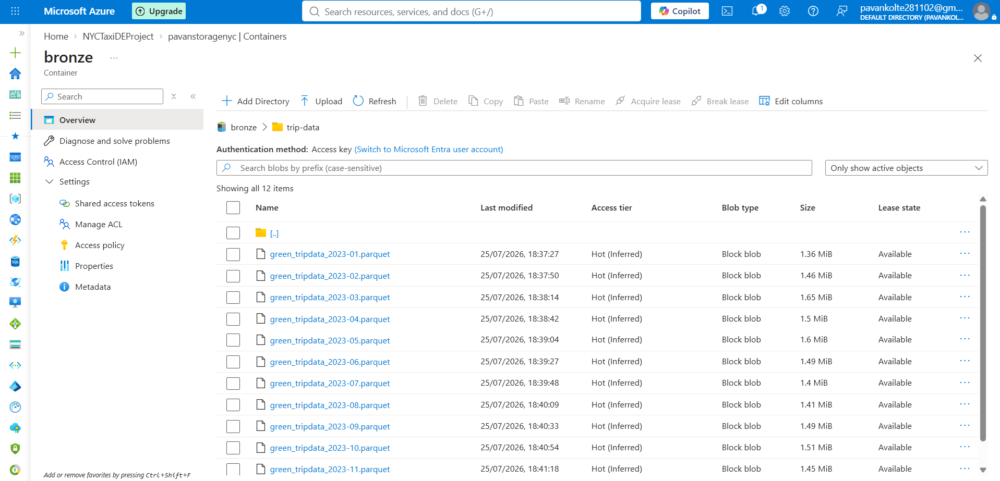
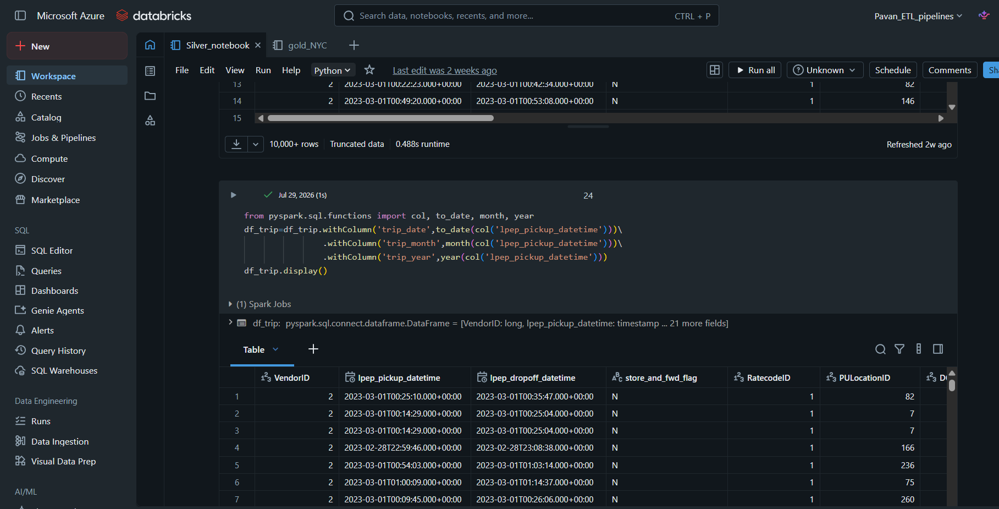
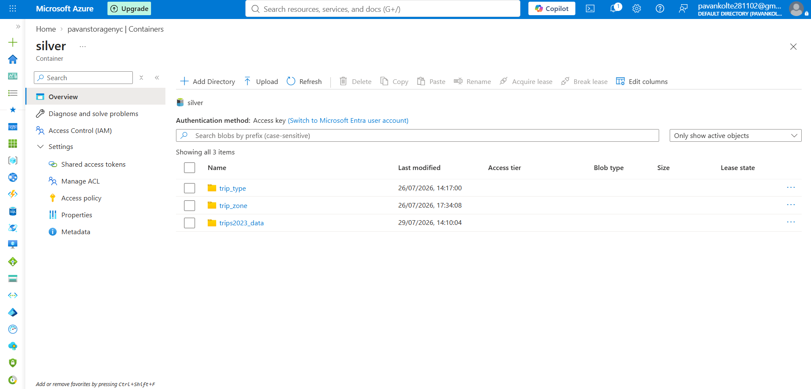
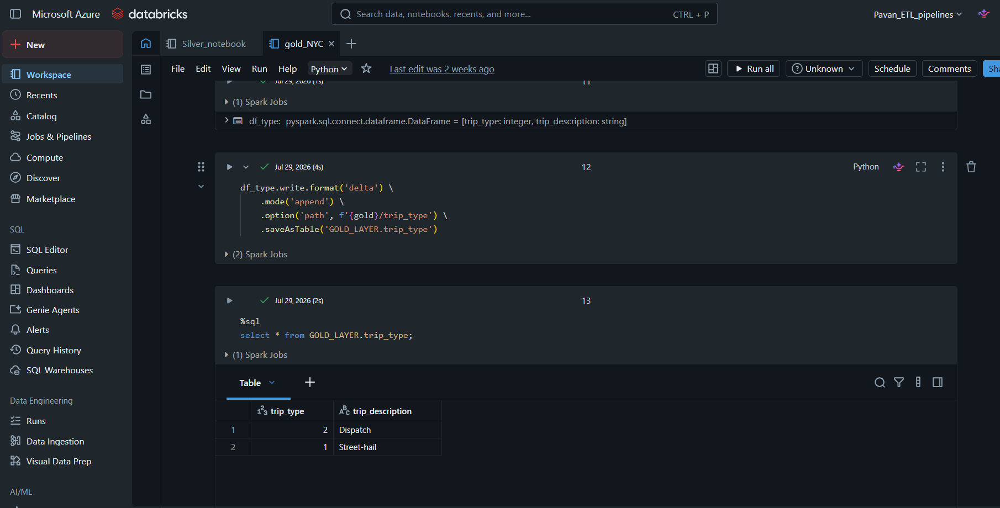
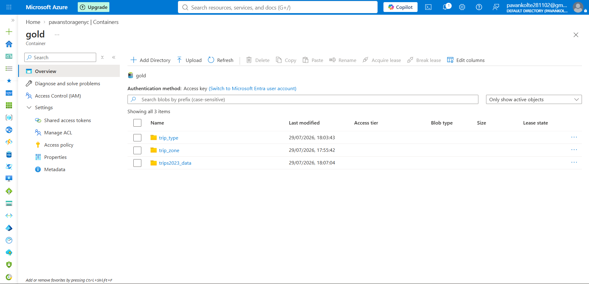

# NYC Taxi End-to-End Data Engineering Pipeline

## Project Overview

This project implements an end-to-end data engineering pipeline for processing NYC Taxi trip data using Microsoft Azure.

The pipeline follows a **Bronze-Silver-Gold architecture**. Azure Data Factory is used for data ingestion, Azure Data Lake Storage Gen2 is used for data storage, and Azure Databricks with PySpark is used for data transformation and processing.

The raw NYC Taxi data is ingested from an HTTP source into ADLS Gen2, transformed using PySpark in Azure Databricks, and stored in the Silver and Gold layers. The Gold layer uses Delta Tables for curated and analytical-ready data.

---

## Architecture

## Data Pipeline Flow

The pipeline follows a **Medallion Architecture** consisting of Bronze, Silver, and Gold layers.

| Layer        | Processing                                                                                                  | Output                         |
| ------------ | ----------------------------------------------------------------------------------------------------------- | ------------------------------ |
| **Bronze**   | Raw data ingestion from HTTP source using Azure Data Factory                                                | Raw Parquet files in ADLS Gen2 |
| **Silver**   | Data cleaning, filtering, null handling, duplicate removal, and data type transformations using Pyspark     | Cleaned Parquet files          |
| **Gold**     | Business transformations, aggregations, and creation of analytical datasets using Databricks and Delta Lake | Delta tables                   |
| **Power BI** | Connects to the curated Gold layer for data visualization and analysis                                      | Interactive dashboards         |

---
NYC Taxi Dataset
       ↓
Azure Data Factory
       ↓
ADLS Gen2 - Bronze Layer
       ↓
Azure Databricks / PySpark
       ↓
ADLS Gen2 - Silver Layer
       ↓
Databricks / Delta Lake
       ↓
ADLS Gen2 - Gold Layer
       ↓
Power BI
       ↓
Interactive Dashboard
---

## Technologies Used

- Microsoft Azure
- Azure Data Factory
- Azure Data Lake Storage Gen2
- Azure Databricks
- PySpark
- Apache Spark
- Delta Lake
- GitHub

---

## Pipeline Flow

### 1. Data Ingestion

Azure Data Factory is used to dynamically ingest NYC Taxi data from an HTTP source into Azure Data Lake Storage Gen2.

The source data is loaded into the Bronze layer in Parquet format.

### 2. Bronze Layer

The raw NYC Taxi Parquet files are stored in the Bronze layer of ADLS Gen2.

The Bronze layer preserves the source data in its original/raw form.

A small representative sample of the raw data is included in this GitHub repository, while the complete dataset is stored in ADLS Gen2.

### 3. Silver Layer

Azure Databricks reads the Bronze data from ADLS Gen2 using secure Service Principal authentication.

PySpark is used to perform data cleansing and transformation, including:

- Data type transformations
- Null handling
- Duplicate removal
- Column transformations
- Data filtering
- Data quality processing

The transformed data is written to the Silver layer in ADLS Gen2.

### 4. Gold Layer

The Silver data is further processed in Azure Databricks to create the Gold layer.

The Gold data is stored using **Delta Lake** and registered as Delta Tables.

The Gold layer contains curated and analytical-ready data.

Example:

```python
df_type.write.format("delta") \
    .mode("append") \
    .option("path", f"{gold}/trip_type") \
    .saveAsTable("GOLD_LAYER.trip_type")
```

---

## Data Lake Architecture

```text
ADLS Gen2
│
├── bronze/
│   └── Raw NYC Taxi Data
│
├── silver/
│   └── Transformed and Cleaned Data
│
└── gold/
    └── Curated Delta Data
```

---

## Repository Structure

```text
azure-end-to-end-nyc-taxi-data-pipeline/
│
├── adf/
│   ├── ARMTemplateForFactory.json
│   ├── ARMTemplateParametersForFactory.json
│   ├── linkedTemplates/
│   ├── pipelines/
│   ├── datasets/
│   └── linkedServices/
│
├── bronze/
│   ├── sample/
│   │   ├── green_tripdata_2023-01.parquet
│   │   ├── green_tripdata_2023-03.parquet
│   │   ├── green_tripdata_2023-05.parquet
│   │   └── README.md
│   └── README.md
│
├── databricks/
│   └── notebooks/
│       ├── NYC_Taxi_Silver_Transformation.py
│       └── NYC_Taxi_Gold_Delta.py
│
├── gold/
│   └── README.md
│
├── screenshots/
│   ├── 01-adf-pipeline.png
│   ├── 02-adls-bronze.png
│   ├── 03-bronze-trip-data.png
│   ├── 04-databricks-silver.png
│   ├── 05-adls-silver.png
│   ├── 06-databricks-gold-delta.png
│   └── 07-adls-gold.png
│
└── README.md
```

---

## Project Screenshots

### 1. Azure Data Factory Pipeline



Azure Data Factory is used to dynamically ingest NYC Taxi data from the HTTP source and load it into ADLS Gen2.

### 2. ADLS Gen2 - Bronze Layer



The Bronze layer stores the raw NYC Taxi data in ADLS Gen2.

### 3. Bronze Sample Data



Representative NYC Taxi Parquet files stored in the Bronze layer.

### 4. Databricks - Silver Transformation



Azure Databricks and PySpark are used to read the Bronze data and perform data cleansing and transformation.

### 5. ADLS Gen2 - Silver Layer



The transformed data is stored in the Silver layer of ADLS Gen2.

### 6. Databricks - Gold Delta Table



The Gold layer is created using Delta Lake. The processed data is written as Delta Tables in Databricks.

### 7. ADLS Gen2 - Gold Layer



The curated Gold datasets are stored in the Gold layer of ADLS Gen2.

---

## Key Features

- End-to-end Azure data engineering pipeline
- Dynamic data ingestion using Azure Data Factory
- HTTP-based NYC Taxi data ingestion
- Azure Data Lake Storage Gen2 implementation
- Bronze-Silver-Gold architecture
- Secure Service Principal authentication
- PySpark-based data transformation
- Data cleansing and quality processing
- Delta Lake implementation
- Databricks Delta Tables
- GitHub-based project version control

---

## Security

Sensitive information is not stored in this repository.

The following information has been excluded from GitHub:

- Service Principal secrets
- Client secrets
- Storage account keys
- Passwords
- Authentication tokens

---

## Data Flow Summary

```text
HTTP Source
    |
    v
Azure Data Factory
    |
    v
ADLS Gen2
Bronze Layer
    |
    | Secure Service Principal Authentication
    v
Azure Databricks
PySpark Transformations
    |
    v
ADLS Gen2
Silver Layer
    |
    v
Azure Databricks
Delta Lake
    |
    v
Gold Layer
Delta Tables
```

---

## Conclusion

This project demonstrates the implementation of an end-to-end cloud data engineering pipeline using Microsoft Azure.

The pipeline covers:

- Data ingestion
- Cloud data storage
- Data cleansing
- Data transformation
- Data quality processing
- Delta Lake implementation
- Curated analytical data

The project provides practical experience with **Azure Data Factory, ADLS Gen2, Azure Databricks, PySpark, Apache Spark, and Delta Lake**.

---

## Author

**Pavan Kolte**

Data Engineering | Azure | Databricks | PySpark | SQL
